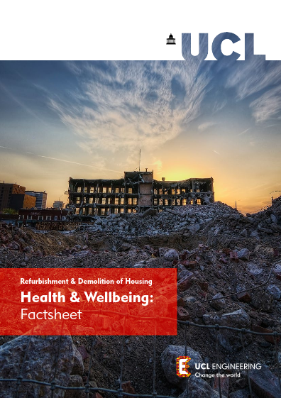

<h1>Resources</h1>


We have produced five guides for tenants and residents facing the redevelopment of their estates. Feel free to use them on your estate as they are, or copy the content to use in your own newsletters or campaigning factsheets.

## Our Guides
|    |          |   |
|----------|:-------------|------:|
|  |  [Seven reasons to be wary of 'estate regeneration'](../Handout_1.pdf) |
|  |  [Resident-led regeneration: proposing alternatives to demolition](../Handout_3.pdf)   |
|  | [Demolition ballots: 10 questions to ask before you cast your vote](../Handout_4.pdf) |
|  | [CPO guide for leaseholders on estates earmarked for demolition](../cpoguide.pdf) |
|  | [Our Alternative Good Practice Guide to estate regeneration](../alternative-good-practice-guide-to-estate-regeneration.pdf)  |

## Making the case for refurbishment
 The [Engineering Exchange at UCL](https://www.ucl.ac.uk/engineering-exchange/) have produced a series of factsheets, videos and a peer-reviewed report, which show that refurbishment is the better option socially and environmentally.

 |    |          |   |
|----------|:-------------|------:|
|  |  [Demolition or refurbishment of social housing - a review of the evidence](../https://www.ucl.ac.uk/engineering-exchange/sites/engineering-exchange/files/report-refurbishment-demolition-social-housing_1.pdf) |
|  |  [Embodied Carbon: Factsheet](https://www.ucl.ac.uk/engineering-exchange/sites/engineering-exchange/files/fact-sheet-embodied-carbon-social-housing.pdf)   |
|  | [Health and Well-being: Factsheet](https://www.ucl.ac.uk/engineering-exchange/sites/engineering-exchange/files/fact-sheet-health-and-wellbeing-social-housing.pdf) |
|  | [Lifespans and Decisions: Factsheet](https://www.ucl.ac.uk/engineering-exchange/sites/engineering-exchange/files/fact-sheet-lifespan-and-decisions-social-housing.pdf) |
|  | [Policy Briefing: Making decisions on demolition or refurbishment of social housing](https://www.ucl.ac.uk/engineering-exchange/sites/engineering-exchange/files/policy_brief_refurbishment_and_demolition_of_social_housing.pdf)  |
|  | [Refurbishment and Demolition: Community Toolkit](https://www.ucl.ac.uk/engineering-exchange/sites/engineering-exchange/files/ucl150_a4-demolition-toolkit_v4_online.pdf)  |

<iframe width="560" height="315" src="https://www.youtube.com/embed/jFo_aFlg41Y?si=hI3fy1e0dJBFLwbz" title="YouTube video player" frameborder="0" allow="accelerometer; autoplay; clipboard-write; encrypted-media; gyroscope; picture-in-picture; web-share" referrerpolicy="strict-origin-when-cross-origin" allowfullscreen></iframe>

<iframe width="560" height="315" src="https://www.youtube.com/embed/VwO5lyUiZpc?si=R-XQMe2FVTSXUQaA" title="YouTube video player" frameborder="0" allow="accelerometer; autoplay; clipboard-write; encrypted-media; gyroscope; picture-in-picture; web-share" referrerpolicy="strict-origin-when-cross-origin" allowfullscreen></iframe>

<iframe width="560" height="315" src="https://www.youtube.com/embed/A1OaRsFgg-E?si=E8rZ_b6wJ9-umqDB" title="YouTube video player" frameborder="0" allow="accelerometer; autoplay; clipboard-write; encrypted-media; gyroscope; picture-in-picture; web-share" referrerpolicy="strict-origin-when-cross-origin" allowfullscreen></iframe>

